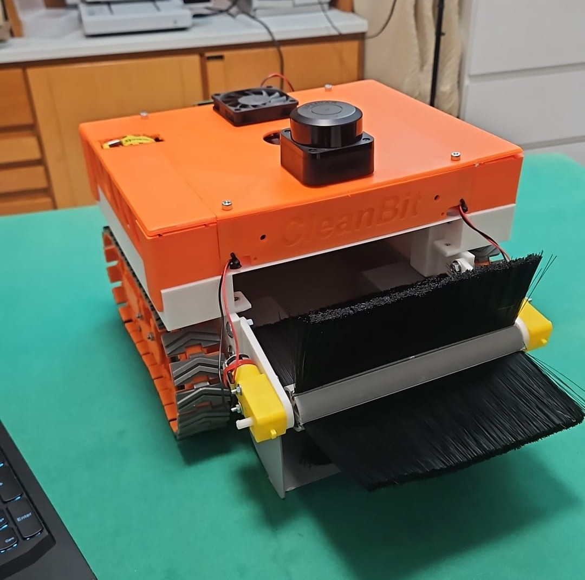

# Cleanbit

**Cleanbit** is an autonomous outdoor robotic platform developed for waste management and cleaning-related applications.  

<p align="center">
  
</p>

## Technical Overview

Cleanbit is based on a **differential-drive mobile architecture** actuated by **JGA250 motors** and equipped with an **RPLidar C1** for perception.  
The robot currently supports:

- **SLAM-based operation**
- **autonomous navigation to user-defined target coordinates**
- **a functional brush subsystem**, already implemented and under further optimization

The system is built around a layered control architecture:

- a **Raspberry Pi 4B** handles high-level autonomy tasks, including **ROS 2 execution**, **SLAM**, and **navigation**;
- an **Arduino Nano** manages low-level motor communication, encoder acquisition, and odometry computation;
- an **STM32 Nucleo board** is used for **battery management** and **brush speed control**.

## Hardware and Embedded Architecture

### Motors
- **JGA25-370 DC Motors** for differential-drive locomotion
- **DC Motor reductors (3-6 V)** for brush rotation

### Sensors
- RPLidar C1
- Encoders from JGA25-370 motors


## Design and Validation

### CAD Model
The robot was first designed using **Fusion360**.


### Gazebo Simulation
Gazebo was used to validate robot behavior and the navigation workflow in a simulated environment. More on that [here](https://github.com/FedericoGGiuliana/cleanbit_simulate.git).


### RViz Visualization
RViz was used to inspect robot state, LiDAR data, mapping/localization outputs, and navigation behavior.


## Installation and Running

Cleanbit has been developed for **Ubuntu 22.04** with **ROS 2 Humble**.

### List of Dependencies

The current software stack relies on the following ROS 2 packages:

- `slam_toolbox`
- `navigation2`
- `nav2_bringup`
- `joy`
- `teleop_twist_joy`
- `twist_mux`
- `robot_state_publisher`
- `joint_state_publisher`
- `xacro`
- `tf2_ros`
- `sllidar_ros2`

### Clone the Repository on your Raspberry Pi

```bash
git clone https://github.com/FedericoGGiuliana/cleanbit_control.git
cd cleanbit
```

### Install ROS2 Dependencies

```bash
sudo apt update
sudo apt install \
  ros-humble-slam-toolbox \
  ros-humble-navigation2 \
  ros-humble-nav2-bringup \
  ros-humble-joy \
  ros-humble-teleop-twist-joy \
  ros-humble-twist-mux \
  ros-humble-robot-state-publisher \
  ros-humble-joint-state-publisher \
  ros-humble-xacro \
  ros-humble-tf2-ros
```

### Install LiDAR Driver

Cleanbit requires the RPLidar ROS 2 driver to interface with the RPLidar C1 sensor.

Clone the driver into the workspace before building:

```bash
cd src
git clone https://github.com/Slamtec/sllidar_ros2.git
cd ..
rosdep install --from-paths src --ignore-src -r -y
colcon build
```

### Install Workspace Dependencies

```bash
rosdep update
rosdep install --from-paths src --ignore-src -r -y
```

### Build the Workspace

```bash
source /opt/ros/humble/setup.bash
colcon build
source install/setup.bash
```

### Launch

On the Raspberry Pi:
```bash
ros2 launch cleanbit_control robot.launch.py
```

**Note:** At the moment, the Nav2 stack must be launched separately from the rest of the package.
On the Raspberry Pi:
```bash
...
```

On your PC:
```bash
export ROS_DOMAIN_ID=0
source /opt/ros/humble/setup.bash
rviz2
```


